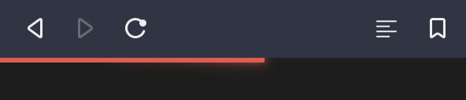

<div align="center">
  <a href="https://www.npmjs.com/package/loading-progress-bar">
    
  </a>
  <a href="https://bundlephobia.com/result?p=loading-progress-bar">
    
  </a>
  <a href="https://travis-ci.com//sumbad/loading-progress-bar?branch=master">
    
  </a>
  <a href="https://codecov.io/gh/sumbad/loading-progress-bar">
    
  </a>
</div>

<h1 align="center">loading-progress-bar</h1>

<div align="center">
  <a href="https://github.com/sumbad/loading-progress-bar">
    <object data="https://raw.githubusercontent.com/sumbad/loading-progress-bar/master/title.png" type="image/png">
      
    </object>
  </a>
  <blockquote align="center">The universal, framework-agnostic loading progress bar component</blockquote>
</div>

- [Installation](#installation)
- [Usage](#usage)
- [API](#api)
- [Options](#options)

---

## Installation

```
npm install loading-progress-bar --save
```

Or use one of the following content delivery networks:

[unpkg.com CDN](https://unpkg.com/loading-progress-bar?module):

```html
<script src="https://unpkg.com/loading-progress-bar"></script>
```

[Skypack CDN](https://cdn.skypack.dev/loading-progress-bar):

```html
<script src="https://cdn.skypack.dev/loading-progress-bar"></script>
```

---

## Usage

### Without bundling

[Demo](https://codepen.io/sumbad/pen/XWdyKNd?editors=1000)

**index.html**

```html
<!DOCTYPE html>
<html lang="en">
  <head>
    <meta charset="UTF-8" />
    <meta name="viewport" content="width=device-width, initial-scale=1.0" />
    <title>Document</title>
    <script src="https://unpkg.com/loading-progress-bar"></script>
  </head>

  <body>
    <loading-progress-bar id="loadingProgressBar"></loading-progress-bar>

    <script>
      LoadingProgressBar.loadingProgressBar('loading-progress-bar');
      const loadingProgressBarEl = document.querySelector('#loadingProgressBar');
      setInterval(() => {
        loadingProgressBarEl.generateProgress.next();
      }, 3000);
    </script>
  </body>
</html>
```

### With ReactJS

[Demo](https://codesandbox.io/s/wizardly-dawn-064gl?file=/src/App.tsx)

**index.jsx**

```jsx
import React, { useRef, useEffect } from 'react';
import { loadingProgressBar } from 'loading-progress-bar';
import { elementToReact } from '@web-companions/react-adapter';

const LoadingProgressBarReact = loadingProgressBar('loading-progress-bar').adapter(elementToReact);

export default function Example() {
  const myRef = useRef(null);

  useEffect(() => {
    setInterval(() => {
      myRef.current.generateProgress.next();
    }, 3000);
  });

  return (
    <div>
      <LoadingProgressBarReact ref={myRef}></LoadingProgressBarReact>
    </div>
  );
}
```

### With bundling (e.g. Webpack, Rollup, Snowpack and etc.)

**index.js**

```js
import { loadingProgressBar } from 'loading-progress-bar';

loadingProgressBar('loading-progress-bar');

// next code depends on your project
const loadingProgressBarEl = document.createElement('loading-progress-bar');
document.body.append(loadingProgressBarEl);
```

---

## API

- **generateProgress**: Generator;
  - To generate the next progress step.
- **togglePause**: (isPause?: boolean) => void
  - To pause and continue the process.

---

## Options

<table>
  <thead>
    <tr>
    <th>Property</th>
    <th>Attribute</th>
    <th>Type</th>
    <th>Default</th>
    <th>Description</th>
    </tr>
  </thead>
  <tbody>
    <tr>
      <td>
        <code>color</code>
      </td>
      <td>
        <code>color</code>
      </td>
      <td>
        String
      </td>
      <td>
        `#ef534e`
      </td>
      <td>
        Sets the main color for Loading Progress Bar.
      </td>
    </tr>
    <tr>
      <td>
        <code>config</code>
      </td>
      <td>
        -
      </td>
      <td>
        Object
      </td>
      <td>
        <code>{duration: 2000, stepsCount: 1}</code>
      </td>
      <td>
        <b>duration</b> - the animation duration.
        <br>
        <b>stepsCount</b> - count steps from start to end the animation. 
        Shows how many times need to invoke the function <code>generateProgress.next</code> to end the animation.
      </td>
    </tr>
  </tbody>
</table>
